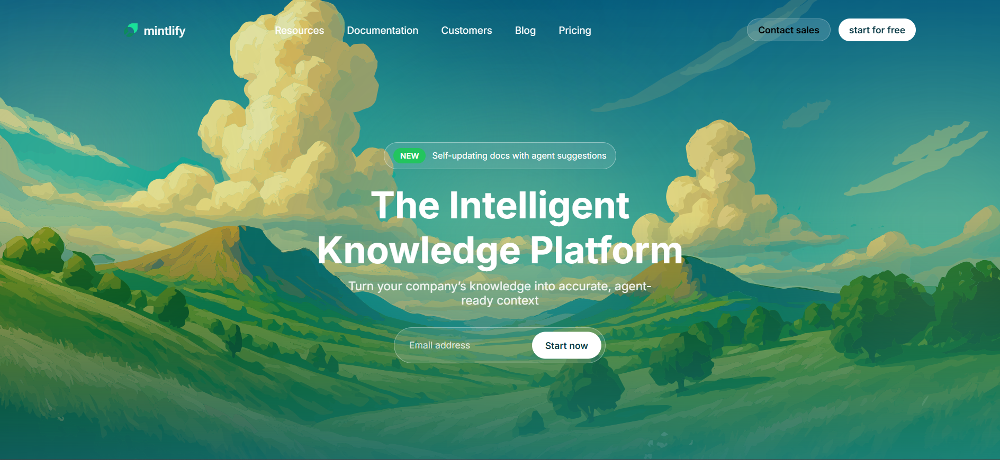
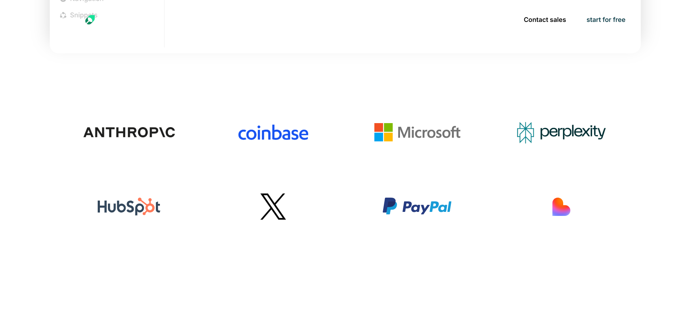
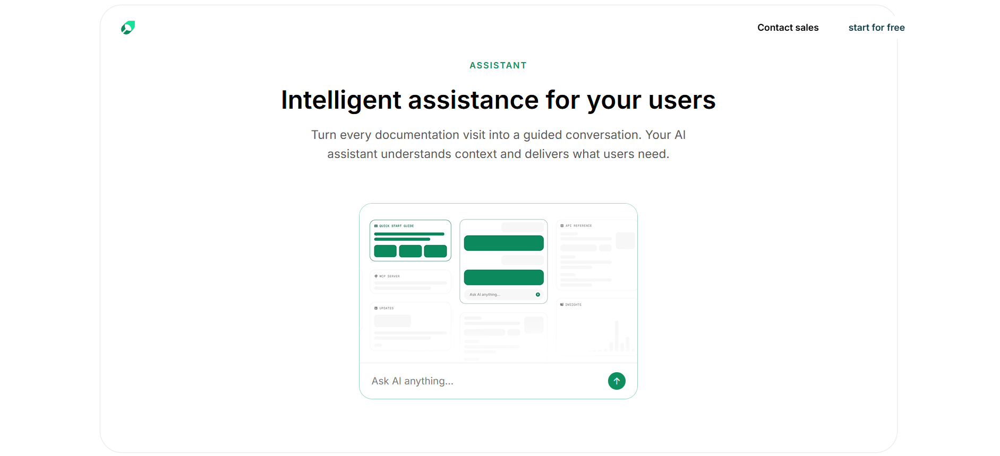
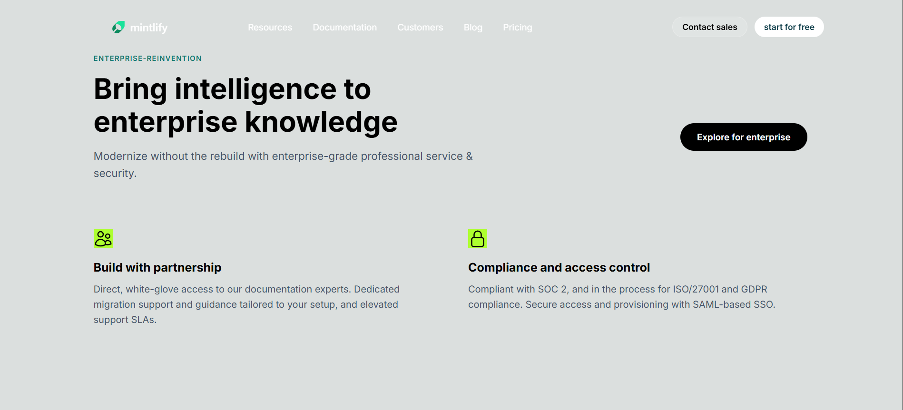
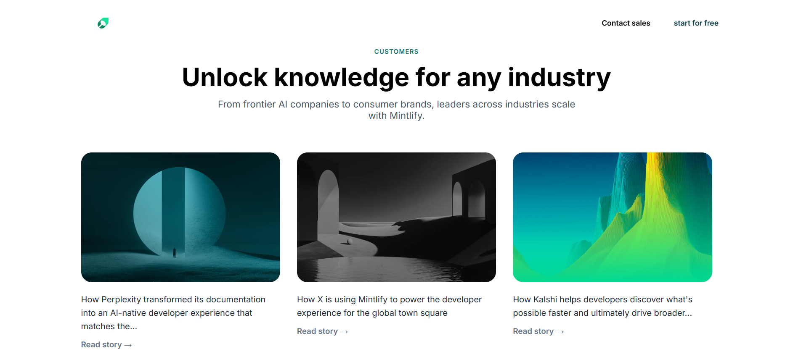
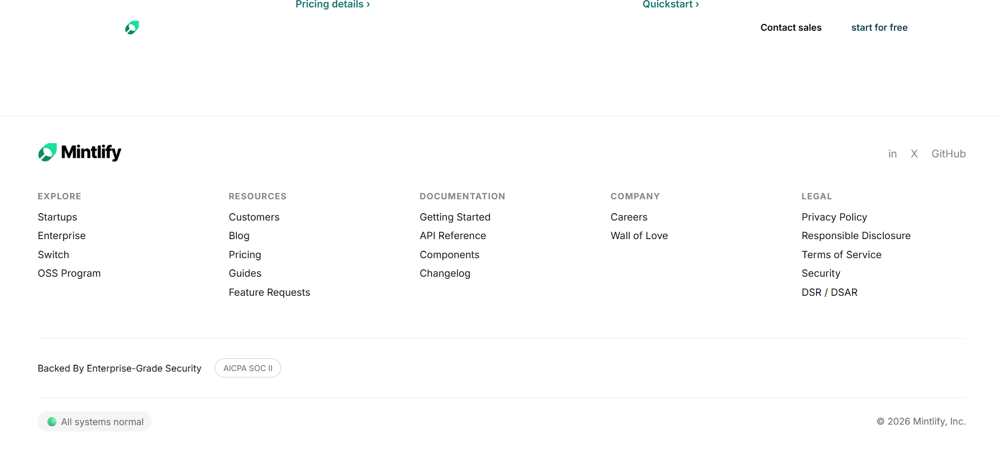

# Mintlify Landing Page Clone (HTML & CSS)

This repository contains a detailed front-end recreation of the **Mintlify official landing page** using **pure HTML and CSS**.  
The goal of this project is to closely replicate the original UI/UX, including layout structure, typography, spacing, colors, and component hierarchy, while keeping the codebase clean, readable, and beginner-friendly.

This project was built as a **frontend practice + UI cloning assignment**, focusing on real-world design accuracy and modern layout techniques.

---

## 🔗 Live Demo (Hosted Website)

👉 **Live Website (Netlify):**  
https://zippy-jelly-7c91f9.netlify.app/

linkedin video link:
https://www.linkedin.com/posts/peeyush-tiwari-a4b802319_assignmentcompleted-learningbydoing-chaicode-activity-7424749245921959936-kXXZ?utm_source=share&utm_medium=member_android&rcm=ACoAAFC-Q1sB70Nh5GBwvPT0avmpakfjWxwwDeA


---

## 📌 Sections Recreated

The following major sections have been recreated based on the Mintlify landing page design:

- Sticky Navigation Bar (Logo, Navigation Links, CTA Buttons)
- Hero Section with Badge, Headline & Email CTA
- Trusted By Logos Section
- Features Section (AI-first documentation features)
- Intelligent Assistant Section (Video + Input UI)
- Enterprise / Enterprise Reinvention Section
- Customer Story Highlight (Anthropic)
- Customer Logos & Industry Cards
- Horizontally Scrollable Customer Stories
- Final Call To Action Section
- Complete Footer with Multi-column Links & Status Indicator

---

## 📸 Desktop View Screenshots

Below are desktop preview screenshots of the project UI:









---

## 🎨 Fonts Used

- **Primary Font:** Inter  
- **Fallback Fonts:**


font-family: 'Inter', -apple-system, BlinkMacSystemFont, 'Segoe UI', sans-serif;
## 🎯 Color Palette

| Usage | Color Code |
|------|-----------|
| Main Background | `#ffffff` |
| Gradient Hero Background | `#0b4b5a → #1f8a8a` |
| Section Background | `#ffffff` |
| Border Color | `#e5e7eb` |
| Primary Text | `#000000` |
| Secondary Text | `#475569` |
| Muted Text | `#64748b` |
| Accent / Highlight Color | `#0f766e` |
| CTA Button Background | `#000000` |
| CTA Button Text | `#ffffff` |


Colors were chosen to closely match the original Mintlify design and maintain strong contrast and readability.
---
🛠️ Technologies Used

1. HTML5 – Semantic markup

2. CSS3 – Styling & layout

3. Flexbox – Alignment and layout control

4. CSS Grid – Complex section layouts

5. Video & Image Embeds – UI realism
---

## 📂 Project Structure

 ```
├── index.html
├── style.css
├── images/
├── videos/
├── screenshots/
│   ├── image1.png
│   ├── image2.png
│   └── image3.png
└── README.md
```
##🚀 How to Run Locally

1.Clone the repository:

git clone https://github.com/peeyushtiwari888/mintlify


2.Navigate to the project folder:

cd mintlify-website


3.Open index.html in any modern browser (Chrome, Edge, Firefox).
---

##🚀 Future Improvements

1.Add JavaScript-based interactivity

2.Improve accessibility (ARIA roles & keyboard navigation)

3.Add subtle animations & transitions

4.Optimize for full mobile responsiveness

5.Refactor CSS using variables & reusable utility classes

---   
##😊 Happy Coding

This project was built with attention to detail, modern UI practices, and a focus on improving frontend development skills.
Feel free to explore the code, experiment with layouts, and build upon it.

Happy Coding! 🚀
---
##👤 Author

Peeyush Tiwari
🎓 Software Engineer | Frontend Enthusiast

🔗 LinkedIn:
https://www.linkedin.com/in/peeyush-tiwari-a4b802319

🐙 GitHub:
https://github.com/peeyushtiwari888


